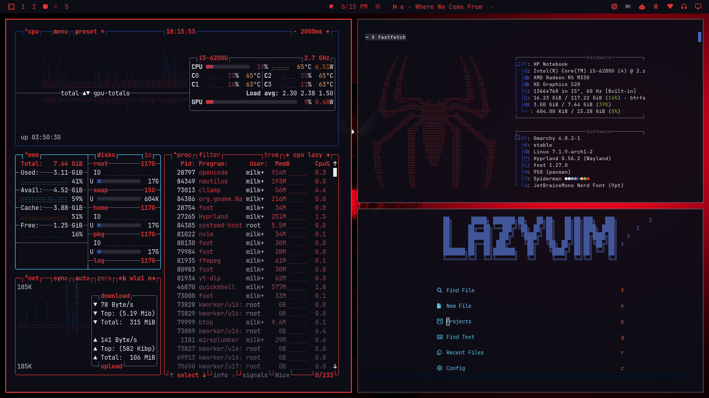
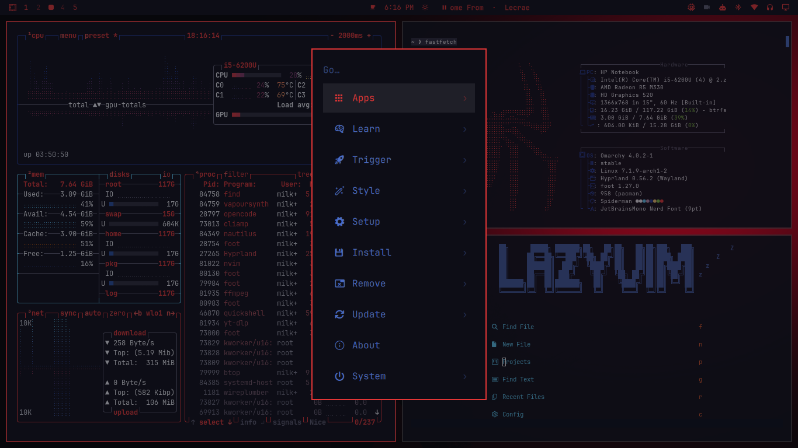

# Spider-Man Omarchy Theme

A dark Spider-Man theme for [Omarchy](https://omarchy.org/) — crimson spidey
red accents, deep midnight navy backgrounds, and a slate-blue secondary palette.
Includes matching wallpapers, lock screen, terminal, a custom Nautilus/GTK
overlay, red folder icons, a btop system monitor theme, and Neovim colorscheme.





## Install

Requires Omarchy with Hyprland.

```bash
omarchy theme install https://github.com/milky86x/omarchy-spiderman-theme.git
```

This sets the theme and applies wallpapers, lock screen, colors, terminal,
bar, btop theme, and shell launcher/menu colors.

### Icon theme (red folders)

The theme ships a custom icon theme with spidey-red folder icons. After
installing the theme, copy the icon theme into your user icons directory and
set it:

```bash
cp -r ~/.config/omarchy/themes/spiderman/icon-theme/Spider-Man-Red ~/.local/share/icons/
gtk-update-icon-cache -q ~/.local/share/icons/Spider-Man-Red
gsettings set org.gnome.desktop.interface icon-theme 'Spider-Man-Red'
```

### Nautilus / GTK accent theme (optional extra)

The GTK overlay that recolors Nautilus and other GTK apps is applied by a
`theme-set` hook. Once per machine, install the hook bundled in this repo:

```bash
omarchy hook install theme-set gtk-theme.hook
omarchy theme set spiderman
```

(`gtk-theme.hook` lives at `hooks/theme-set.d/gtk-theme.hook` in the
repository. If `omarchy hook install` prompts for a path, point it there.)

The hook copies the theme's `gtk-theme/` CSS into `~/.config/gtk-4.0/` and
`~/.config/gtk-3.0/` every time a theme is applied. Switching to a theme that
ships no GTK overlay removes it and falls back to Adwaita defaults. Reopen
Nautilus to see the change. You can uninstall the hook with
`omarchy hook uninstall theme-set gtk-theme.hook`.

## What's included

| Item | File |
|------|------|
| Color palette (dark) | `colors.toml` |
| Icon theme (spidey red folders) | `icons.theme` + `icon-theme/Spider-Man-Red/` |
| Neovim colorscheme (aether) | `neovim.lua` *(regenerated from `colors.toml` on install)* |
| Chromium/Chrome/Edge/Brave color | `chromium.theme` |
| Bar accent | `shell.bar.toml` |
| Launcher + menu colors | `shell.launcher.toml`, `shell.menu.toml` |
| btop system monitor theme | `btop.theme` |
| Lock screen art | `unlock.png`, `preview-unlock.png` |
| Wallpapers | `backgrounds/` |
| Nautilus / GTK3+GTK4 overlay | `gtk-theme/` |
| Theme-set hook (GTK + icons) | `hooks/theme-set.d/gtk-theme.hook` |
| Theme preview (picker) | `preview.png` |
| Gallery screenshot | `gallery.png` |

## Palette

| Role | Color |
|------|-------|
| Crimson spidey red (accent) | `#E50914` |
| Midnight navy (background) | `#0B1120` |
| Deep slate blue (surface) | `#1B2A44` |
| Slate blue (selection) | `#242F4D` |
| Web white (foreground) | `#F5F7FF` |
| Spider blue | `#3D5A9E` |

## Background credits

Wallpapers are fan/official Spider-Man artwork collected from wallpaper sites.
See the `backgrounds/` directory. Confirm redistribution rights before shipping
the theme publicly; swap in your own art if needed. Distributed for personal use.

## License

MIT — see [LICENSE](LICENSE). Wallpaper artwork is not covered by the MIT
license; see the background credits above.
