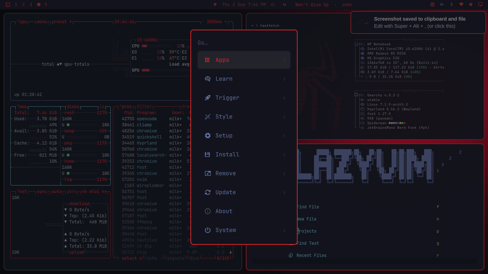

# Spider-Man Omarchy Theme

A dark Spider-Man theme for [Omarchy](https://omarchy.org/) — crimson spidey
red accents, deep night backgrounds, and a slate secondary palette. Includes
matching wallpapers, lock screen, terminal, a custom Nautilus/GTK overlay,
red folder icons, a btop system monitor theme, and a Neovim colorscheme.




## Install

Requires Omarchy with Hyprland.

```bash
omarchy theme install https://github.com/milky86x/omarchy-spiderman-theme.git
```

This sets the theme and applies wallpapers, lock screen, colors, terminal,
bar, btop theme, and shell launcher/menu colors.

### Icon theme (red folders)

The file manager uses the `Yaru-red` icon theme (red folders), set via
`icons.theme`. Omarchy applies it automatically when the theme is activated;
if you have already installed the theme, re-apply it to pick it up:

```bash
omarchy theme set spiderman
```

### Nautilus / GTK accent theme

The GTK overlay that recolors Nautilus and other GTK apps is applied by a
`theme-set` hook. Once per machine, install the hook bundled in this repo:

```bash
omarchy hook install theme-set gtk-theme.hook
omarchy theme set spiderman
```

(`gtk-theme.hook` lives at `hooks/theme-set.d/gtk-theme.hook` in the
repository. If `omarchy hook install` prompts for a path, point it there.)

The hook copies the theme's `gtk-theme/` CSS into `~/.config/gtk-4.0/` and
`~/.config/gtk-3.0/` every time a theme is applied. Switching to a theme that
ships no GTK overlay removes it and falls back to Adwaita defaults. Reopen
Nautilus to see the change. You can uninstall the hook with
`omarchy hook uninstall theme-set gtk-theme.hook`.

### Fastfetch logo

The same hook also manages the `fastfetch` logo (`~/.config/omarchy/branding/
about.txt`) so it is theme-specific:

- While the **Spider-Man** theme is active, fastfetch shows this theme's custom
  logo (`about.txt`).
- Switching to any other theme installs the stock Omarchy symbol logo, so your
  custom logo only ever appears with this theme.

Reopen the About panel / `fastfetch` after switching themes to see it.

## What's included

| Item | File |
|------|------|
| Color palette (dark) | `colors.toml` |
| Icon theme (red folders) | `icons.theme` (`Yaru-red`) |
| Neovim colorscheme (aether) | `neovim.lua` *(regenerated from `colors.toml` on install)* |
| Chromium/Chrome/Edge/Brave color | `chromium.theme` |
| Bar accent | `shell.bar.toml` |
| Launcher + menu colors | `shell.launcher.toml`, `shell.menu.toml` |
| btop system monitor theme | `btop.theme` |
| Lock screen art | `unlock.png`, `preview-unlock.png` |
| Wallpapers | `backgrounds/` |
| Nautilus / GTK3+GTK4 overlay | `gtk-theme/` |
| Theme-set hook (GTK + icons + fastfetch logo) | `hooks/theme-set.d/gtk-theme.hook` |
| Fastfetch logo | `about.txt` |
| Theme preview (picker) | `preview.png` |
| Gallery screenshot | `gallery.png` |

## Palette

| Role | Color |
|------|-------|
| Spider red (accent) | `#E62429` |
| Deep night (background) | `#12131C` |
| Surface (sidebar/header) | `#181A26` |
| Darker background | `#0D0E14`, `#08080C` |
| Web white (foreground) | `#E1E1E6` |
| Muted text | `#44475A` |

## Background credits

Wallpapers are fan/official Spider-Man artwork collected from wallpaper sites.
See the `backgrounds/` directory. Confirm redistribution rights before shipping
the theme publicly; swap in your own art if needed. Distributed for personal use.

## License

MIT — see [LICENSE](LICENSE). Wallpaper artwork is not covered by the MIT
license; see the background credits above.